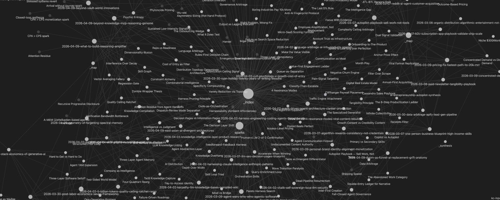
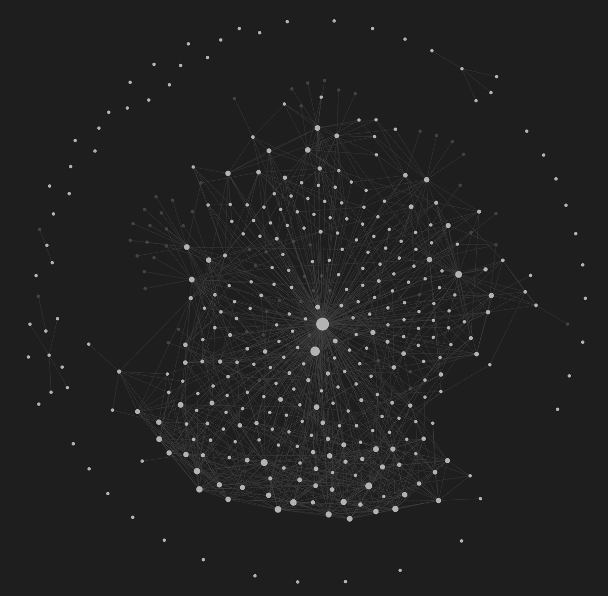
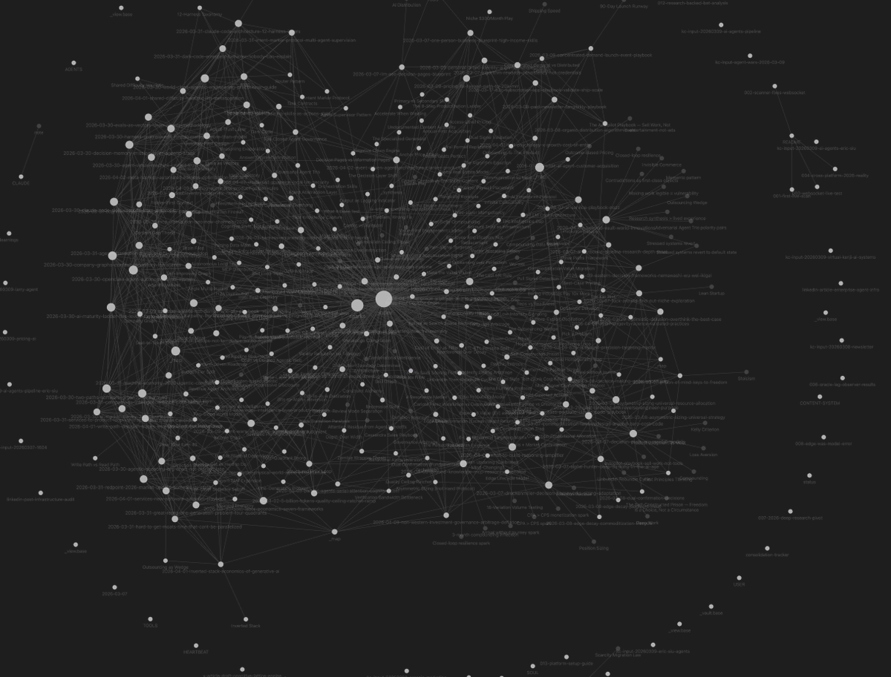

Five weeks ago I started building a system that changed how I relate to everything I read.

Not a note-taking app. Not a "second brain." Not a bookmarking tool with highlights and tags.

A knowledge engine; an AI-powered pipeline that takes every article, video, and thread I consume and does something simple but specific: it extracts the underlying thinking tools from the content, names them, and connects them to everything else I already know. Across every domain of my life.

160+ named mental models so far. Investing. AI. Business. Health. Mindset. Technology. Each one a reusable thinking tool with a clear mechanism and a clear instruction for when to apply it.

When Andrej Karpathy posted about his personal knowledge system in April; 400,000 words, 100+ articles, all compiled by AI into structured markdown, I'd already been building for a month.

Same underlying conviction. Different architecture. And I think the difference matters a lot.

## Karpathy's Insight

Let me start with what he got right, because the foundational idea is important.

Karpathy described his system like this: raw sources go into a folder. The LLM compiles them into a wiki. Markdown files with summaries, backlinks, cross-links, and concept categorization. The human doesn't do the organizing. The human sets the rules and reviews the output.

Then he said something most people scrolled past:

> "The LLM is a compiler, not an assistant."

This matters. Most people treat AI like a conversation partner. Ask something, get an answer, move on. Karpathy treats it like infrastructure. Input goes in. Structured output comes out. Incrementally. At scale.

He also said: *"A large fraction of my recent token throughput is going less into manipulating code, and more into manipulating knowledge."*

That's the former Director of AI at Tesla telling us where the frontier is moving. Not code generation. Not content creation. Knowledge architecture. The AI's job isn't to write for you. It's to structure what you know into something you can think against.

I arrived at the same idea independently. But seeing him validate it from his own practice showed me exactly where my approach forks and why.

## Where I Diverge

Karpathy built a librarian. An excellent, AI-maintained librarian. It compiles what he's read into structured, searchable knowledge. Summaries. Backlinks. Categories.

I built something else.

His system compiles articles into wiki entries, structured representations of what the article said.

Mine compiles articles into **frameworks**. Named, reusable thinking tools that describe how something works and when to use it.

Here's the difference in practice.

Take an article about competitive strategy. Karpathy's system would produce a wiki entry: a summary of the arguments, links to related concepts, a category tag. Good. Searchable. A faithful compression of the source.

My system would extract a framework called **"Edge Decay."**

Two words.

**Mechanism:** Every competitive edge has a shelf life because successful strategies attract imitators, and the window between discovering an advantage and watching it get crowded is shrinking in every field.

**Instruction:** Before doubling down on any edge; a skill, a market position, an investment thesis, ask when this edge was discovered and how many people are running the same play. If the answer is "a lot," you're already in the decay phase. Start looking for the next one.

That's not a summary of what I read. It's a thinking tool I can apply to career decisions, investing, content strategy, health protocols, any domain where competitive dynamics exist.

A wiki entry stores what an article said. A framework stores how to think.

I have 160+ of these. They accumulate like vocabulary. And just like vocabulary, the more you have, the more precisely you can think. "Edge Decay" combined with "Perception Gap" (the distance between reality and what most people believe) immediately generates a question: where are edges decaying that nobody's noticed yet? You can't compose unnamed ideas this fluidly. The names are the interface.

This is what I mean by a **Lattice**. Not a filing cabinet of notes. An interconnected structure of thinking tools that span domains and connect to each other. The connections between frameworks are where original insight lives.

And it doesn't just store and retrieve. It runs. It extracts. It detects patterns. It improves itself.

I call it a **Cognitive Lattice Engine**.

- **Cognitive** — because it's about thinking, not storage.
- **Lattice** — because the frameworks form an interconnected structure across domains, and the cross-domain connections are the whole point.
- **Engine** — because it's not a passive archive. It runs, produces, self-improves, and grows from being used.

## How It Works

### The Filter

Not everything gets compiled. Most of what I read doesn't make it through. That's intentional.

Every piece of content runs through a set of extraction tests. The core question is always: does this change how I think, or does it just confirm what I already know?

- **Can I make a different decision because of this?** If not, it's entertainment.
- **Does this data point genuinely update a belief?** Confirmation isn't knowledge. It's comfort.
- **Can I explain it in two sentences and someone thinks differently after hearing it?** If I can't compress it to a mechanism, it's a fact. Facts decay. Frameworks compound.
- **Is there a specific system; tools, costs, returns that someone could execute and generate revenue within 30 days?** Validated playbooks are as valuable as abstract models.
- **Does it add a genuinely new angle to a framework I already have?** Not new information, a new lens that changes how I apply something I already know.

The extraction rate is low. Maybe 30-40% of what I read produces anything. But that rejection rate is a feature. It means what survives is dense. Compressed. Worth carrying forward.

### Framework Naming

What survives the filter gets a name.

This sounds small. It's not.

A named framework is a compressed pointer to a way of thinking. It's memorable, specific, and distinct enough that you can retrieve it instantly and combine it with other frameworks on the fly.

Bad names describe topics: "The Importance of Adaptability." "Understanding Cognitive Biases." "How Markets Work." These are chapter headings. Nobody thinks in chapter headings.

Good names describe mechanisms: "Edge Decay." "Perception Gap." "Cognitive Homogeneity Trap" — when everyone uses the same AI tools and the same prompts, thinking converges. If your output can be replicated by a basic ChatGPT query, you have zero leverage.

Each framework gets a short definition (the mechanism is what causes what) and a "Use this:" instruction (when and how to apply it, concrete enough to act on this week). These are the atoms of the Lattice. Named. Composable. Permanent.

## Four Paths, Not Two

Most knowledge systems have two outcomes: save or skip.

That binary throws away enormous value.

My system has four paths:

1. **Full Note.** The content is rich enough to extract multiple frameworks, playbooks, or belief-changing data. Gets a permanent note with everything extracted and connected to existing knowledge.
2. **Perspective Shift.** Not rich enough for a full note. But it contains an insight that adds nuance to a framework I already have. Instead of creating something new, it enriches something that exists. The Lattice gets denser without getting wider.
3. **Skip.** Genuinely adds nothing for my specific interests.
4. **Spark.** Below the threshold for a note or even a perspective shift. But there's one small, transferable idea that might apply in a completely different domain. One line. Logged.

Sparks are where something unexpected happens.

They're cheap. One line each. They accumulate quietly. But when three or more sparks cluster around the same theme, a pattern starts to emerge.

**Real example.** I read three AI papers over a few days. None scored high enough for a full note. Each left a spark.

- One about **context engineering** — when agents underperform, the problem is almost never the model. It's the context. Give the same model bad context and it looks stupid. Structured context and it looks brilliant.
- One about **knowledge overhang** — models are far more capable than their default output. The right instruction doesn't teach new capability. It elicits capability that was already there.
- One about **cognitive style** — role prompts don't add expertise. They select a thinking pattern. "Pragmatic CTO" and "helpful assistant" produce radically different output from the same model with the same knowledge.

Three sparks clustered. And the collision landed somewhere I didn't expect.

These three mechanisms aren't about language models. They're about people.

When someone underperforms; at work, in a relationship, in their own habits, the instinct is to question capability. Smart enough? Skilled enough? But three AI architecture insights say the same thing: capability is rarely the bottleneck.

Check the context they're operating in. Check whether their actual strengths are being elicited or suppressed. Check whether they're in the right cognitive mode for the task.

The framework: **"Latent Capacity Diagnostic."** I extracted it from AI papers. I apply it to hiring, self-assessment, and team design; even parenting. No single article produced it. The lattice did.

No other knowledge tool I've found does this. Not Karpathy's system. Not any product. Not any academic paper I've read; and I've gone through the research: A-MEM, ACE, MemoryCD, EvolveR, CoALA. Nobody captures value from rejected content and detects emergent patterns across the rejections.

## Cross-Domain Collisions

This is where original thinking actually comes from. And it's the core reason the system is a Lattice, not a list.

After processing any content; even content that gets rejected, the engine checks: does any concept here collide productively with a framework from a different domain in the vault?

A collision means a concept from one domain and a framework from another domain produce an insight that neither generates alone.

My vault spans six domains so far. The cross-domain surface area is massive.



One collision I keep coming back to: a content strategy framework about why certain posts go viral (every viral piece triggers one of four emotional responses: the reader feels UNDERSTOOD, SMART, WARNED, or given ACCESS to something exclusive) collided with a competitive intelligence framework (create from evidence of what already worked, not from imagination).

Neither is about the other's domain. But the collision produces a complete method: find what already went viral, identify which emotional mechanism made it work, rebuild it from a different angle while preserving that mechanism.

These collisions are mine. Not because the individual frameworks are secret — many came from public posts. But the specific constellation of 160+ frameworks across six domains produces collision surfaces nobody else has.

My reading patterns, my extraction criteria, my domain combinations generate a unique Lattice. And the Lattice IS the thinking.

## The Engine Runs

Two more things make this an engine and not an archive.

### It grows from being used

This is something Karpathy mentioned — he files his Q&A outputs back into his wiki. I pushed this further.

I have an application mode. I bring a real question to the vault. Not a lookup; an open problem. The engine retrieves frameworks from at least two different domains and generates a synthesis that none of the frameworks produce individually.

Then it files the synthesis back.

I asked: *"Can this system become a product others use?"*

The engine retrieved Knowledge Compilation, Self-Improving Graph, and a framework called the **Zombie Wrapper Thesis** — if your product's only differentiation is a prompt, you have no moat; but if accumulated human corrections become rules, those corrections are the moat.

It generated a product architecture and a competitive analysis showing what exists in the research, what exists in products, and what I have that nobody else does.

That synthesis is now a permanent part of the Lattice. The next time I think about product strategy or competitive positioning, the engine is denser and more useful because of the question I asked.

Every question compounds the system. It grows from thinking, not just from reading.

### It improves its own rules

When I correct an extraction; rename a framework, reject something the engine thought was valuable, flag something it missed, those corrections accumulate. After enough similar corrections, the system proposes a new extraction rule. The engine's own filter evolves from use.

A consolidation layer runs periodically: detecting connections across topics, flagging contradictions between frameworks, checking whether sparks have clustered enough to promote, discovering framework combinations I haven't documented yet.

The thing that kills every wiki, every second brain, every knowledge management system is maintenance. Someone has to keep it updated. Humans get bored of maintenance. This engine doesn't. The maintenance is the engine's job. And it gets better at it over time.

## Under the Hood

The whole system is markdown files in folders. That's it.

The vault has a simple structure. One folder per domain; mine are Self-Improvement, AI, Entrepreneurship, Money, Mindset, Tech.

Each folder has a map file that indexes every note in that topic, one line per entry.

A separate Frameworks folder holds the hubs; one file per named framework, collecting every source note and perspective that references it. A Synthesis folder holds the sparks log, the documented framework combinations, filed-back application syntheses, and flagged tensions where frameworks contradict each other.

When a note gets compiled, it looks like this:

```markdown
---
title: "Descriptive Title - 5-15 words"
source_url: "..."
source_author: "..."
topic: ai
topics: [ai, entrepreneurship]
tags: [tag1, tag2]
frameworks:
  - "Edge Decay"
  - "Perception Gap"
relevance: 8
confidence: high
created: 2026-04-12
supports: ["existing-framework"]
contradicts: []
---

## Frameworks

### Edge Decay

Every competitive edge has a shelf life because
successful strategies attract imitators. The window
between discovery and crowd adoption is shrinking.

**Use this:** Before doubling down on any advantage,
ask when this edge was discovered and how many people
are running the same play. If the answer is "a lot,"
start migrating.

## Connections

- [[Perception Gap]]: where edges are decaying that the market hasn't noticed yet
- [[Existing Note]]: specific relationship described
```

Frontmatter tracks metadata. Frameworks section holds the named thinking tools with mechanisms and instructions. Connections section maps how this note links to the rest of the Lattice through wikilinks. If the source has a validated revenue system with tools and costs, a Playbook section captures that too.

But the real engine isn't the vault structure. It's the compilation spec.

The entire system runs on a single markdown file; my `CLAUDE.md`. It contains every rule the AI follows when compiling knowledge: the six topic definitions, my user context (who I am, what I value, what kinds of insight matter to me), the eight extraction tests with pass/fail criteria, the framework naming rules, the four-path routing logic with score thresholds, the full note template, the dedup protocol, the consolidation schedule, and the cross-domain collision check instruction.

The AI reads this spec before processing anything. It's a compiler configuration. Change the spec, change the output.

This is the key architectural insight: **the model is commodity. The compilation spec is the IP.** Claude, GPT, Gemini, any frontier LLM can run this. And the spec evolves. Every correction I make — renaming a framework, rejecting a bad extraction, flagging something the engine missed — accumulates. After enough similar corrections, the system proposes a rule update. The compiler optimizes itself from use.

The whole thing is viewable in Obsidian. The graph view shows the lattice visually: framework hubs as high-connectivity nodes, notes clustered by topic, cross-domain connections as bridges between clusters. But Obsidian is just the viewer. The system is plain text files and a compilation spec. You could run it with any editor and any LLM.



## Reproduce This

You don't need my stack. You need the pattern.

1. **Pick your domains.** Three to six topics broad enough to absorb anything you care about. Mine are Self-Improvement, AI, Entrepreneurship, Money, Mindset, Tech. Yours might be completely different. The domains define where collisions can happen — too few and you won't get cross-domain connections, too many and nothing accumulates density.
2. **Write your context.** One paragraph: who you are, what you're trying to get better at, what kinds of insight actually change your behavior. This isn't a bio. It's a filter. The AI uses it to score relevance for you specifically. An article about pricing strategy might score 9 for a founder and 3 for a researcher. Same article, different context, different extraction.
3. **Define your extraction tests.** Start with three: Does this change a decision I'd make? Can I compress it to a mechanism in two sentences? Does it connect to something I already know in a different domain? You can add more later. The tests are what separate compilation from bookmarking.
4. **Set up the vault.** One folder per domain. A map file in each (just a list of notes). A Frameworks folder with an index file listing every named framework. A sparks file for the micro-principles. This takes ten minutes.
5. **Write your compilation spec.** This is the hard part and the valuable part. A markdown file that tells the AI: here are my topics, here's my context, here are my extraction tests, here's how to name frameworks (mechanism, not topic, two to four words, memorable, specific), here's the note format I want, here are the four paths and when to use each one, here's how to check for cross-domain collisions. Start simple. Refine as you correct the output. The spec should feel rough for the first two weeks. That's fine. The corrections ARE the refinement process.
6. **Feed content and correct.** Process articles, threads, videos. Review every extraction. Rename bad framework names. Reject extractions that don't pass your tests on reflection. Flag things the engine missed. Each correction trains the spec.

**Expect a trough.** The first 30-50 frameworks feel like a lot of effort for not much payoff. The lattice is too sparse for meaningful collisions. Somewhere around 50-80 frameworks, the cross-domain connections start firing. You'll read an article about AI architecture and the engine will connect it to something you extracted from a health article three weeks ago. That's the moment the system starts thinking with you instead of just storing for you.

The full inflection takes about three months of consistent use. Before that, you're building inventory. After that, you're compounding.

## The Knowledge MCP

I'm building this into an open tool.

The problem: most knowledge tools stop at **layer one**. Capture and organize. Save the article, tag it, highlight passages. Notion, Readwise, Pocket. Useful. But they're filing systems.

**Layer two** — extract and reason — is where the Cognitive Lattice Engine lives. Don't just save the article. Extract the named thinking tools. Score them. Route to four paths. Detect cross-domain collisions. Connect to existing knowledge. Capture sparks from rejected content.

**Layer three** — apply and decide — is where the engine becomes intelligence. Bring a real question. Get a multi-domain synthesis. File the reasoning back. The system compounds.

When I went through the research landscape — academic papers on agent memory, knowledge management, cross-domain personalization — I found the same gap everywhere. Everyone builds memory for task execution. Coding assistants remember your codebase. Support bots remember ticket history. Enterprise agents remember company policies.

Nobody builds memory for *thinking*. For cross-domain reasoning. For taking a framework from investing, colliding it with one from health, and producing something neither field would generate on its own.

One benchmark — MemoryCD, the first academic benchmark for cross-domain personalization — explicitly identified this as the unsolved frontier. Their finding: existing methods fail badly in cross-domain settings.

The Cognitive Lattice Engine is my answer to that gap. The extraction intelligence, the spark clustering, the collision detection, the self-improving rules; packaged as an open MCP server that works with any AI agent. Configurable topics, configurable extraction criteria, Obsidian-compatible output.

Your domains. Your frameworks. Your thinking. The engine just makes it compound.

## The Point

There's a framework in my vault I think about constantly. I extracted it from a post by @hmalviya9 a few weeks ago.

When AI makes information free, your brain's easiest move is to outsource everything. Query the model. Get the answer. Move on. But everyone else queried the same model. Everyone got the mathematical average of human thought. The most likely next token.

If your thinking can be replicated by a prompt, you have nothing that's yours.

The gap between information received and conclusion reached is where originality lives.

Most AI tools close that gap for you. Answer faster. Produce the output. Generate the thing.

I think the most valuable AI tools will be the ones that *widen* it. Richer material to think against. More structured frameworks to reason with. More cross-domain connections to draw from. And then they let you do the thinking.

The Cognitive Lattice Engine doesn't think for me. It compiles what I read into named mechanisms and instructions. It detects collisions I might miss. It clusters patterns across rejected content. It maintains itself.

But the synthesis — the moment where two frameworks from completely different domains collide and I see something I wouldn't have seen from either one alone — that's mine.

The AI compiles. The system connects. But what makes the Lattice yours is everything you're curious about: the domains, the questions, the obsessions nobody else shares.

Put infrastructure under that curiosity and it compounds into something no one else could build.
