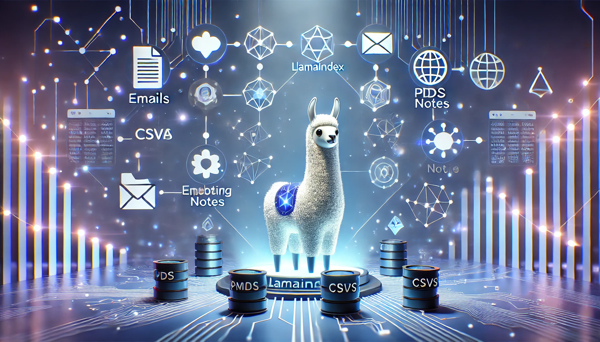

In the world of AI, Large Language Models (LLMs) are revolutionizing how we interact with information. However, these models often lack the context needed to answer specific questions about our personal or company data. This is where [**LlamaIndex**](https://www.llamaindex.ai/) comes in. This powerful framework bridges the gap between LLMs and your data, enabling you to build sophisticated RAG applications that can access and utilize your unique information effectively.

## What is LlamaIndex?

_LlamaIndex_ is an open-source framework that empowers you to build LLM applications, such as chatbots, AI assistants, and translation machines. It provides the tools to enrich your LLM's knowledge base with your own data, whether it's from your emails, databases, or Notion notes. This is achieved by creating a data processing pipeline that transforms your data into a queryable index.

## Key Components of LlamaIndex

The _LlamaIndex_ ecosystem comprises several key components that work together to facilitate data ingestion, processing, and retrieval:

##### **1. Data Connectors**

These connectors ingest data from various structured and unstructured sources, such as PDFs, CSVs, and Word documents, and convert them into a unified format. _LlamaIndex_ offers a wide range of data connectors, including those for popular platforms like Notion.

#### **2. Documents**
Documents are structured representations of your data sources. They are essentially programming objects with properties like `text` or `content` that contain the extracted data, and `metadata` that stores information about the source file, such as its name, ingestion date, and page range.

#### **3. Nodes**
Nodes are granular chunks of information extracted from documents. They retain the metadata from their parent document and are interconnected, forming a network of knowledge. This interconnectedness is a unique feature of _LlamaIndex_ that sets it apart from other frameworks like [**LangChain**](https://www.langchain.com/).

#### **4. Embeddings**
_Embeddings_ are numerical representations of _Nodes_ generated using embedding models. These representations capture the meaning of the information within the nodes and are stored in the index.

#### **5. Index**
The _Index_ is a vector database that stores the embeddings of all your nodes. This is the core component that you query to retrieve relevant information.

#### **6. Router and Retrievers**
When a query is submitted, the _Router_ determines the most appropriate retriever to use. _Retrievers_ employ different strategies to query the index and retrieve the most relevant information.

#### **7. Response Synthesizer**
The _Response Synthesizer_ combines the retrieved documents with a prompt, sends them to the LLM, and generates a response enriched with your custom data.

## Building a Simple LLM Application with LlamaIndex

_LlamaIndex_ offers a streamlined approach to building LLM applications. With just five lines of code, you can implement a complete data processing pipeline:

```python3
from llama_index.core import VectorStoreIndex, SimpleDirectoryReader

# Load data from a directory
documents = SimpleDirectoryReader('data').load_data()

# Create an index
index = VectorStoreIndex.from_documents(documents)

# Initialize a query engine
query_engine = index.as_query_engine()

# Query the index
response = query_engine.query("What is the first article of the US Constitution about?")

# Print the response
print(response)
```

This code snippet demonstrates the simplicity of using _LlamaIndex_ to ingest data from a directory, create an index, and query it using natural language.

## Creating a Knowledge Base from Your Notion Notes

```python3
from llama_index import NotionIndex

# Replace 'your_notion_token' with your actual Notion token
notion_index = NotionIndex(token="your_notion_token", page_id="your_page_id")

# Query the index
query_engine = notion_index.as_query_engine()
response = query_engine.query("What are the key points from the meeting on Tuesday?")
print(response)
```

This example demonstrates how to create a knowledge base directly from your Notion notes. By providing your Notion token and page ID, you can query your notes using natural language.

## Data Persistence with LlamaIndex

_LlamaIndex_ allows you to persist your index, preventing the need to re-ingest and re-index your data every time you run your application. This is crucial for applications dealing with large datasets. The `storage_context.persist()` function enables you to store your index locally, making your application more efficient.

## Leveraging LlamaPars for Complex Documents

For complex documents containing tables, images, and other elements, _LlamaIndex_ provides [**_LlamaPars_**](https://github.com/run-llama/llama_parse), a powerful API that converts unstructured files into organized, structured text. This service is particularly useful for handling intricate document formats that may pose challenges for traditional data connectors.

## Conclusion

_LlamaIndex_ is a versatile and powerful framework that simplifies the process of building LLM applications capable of leveraging your own data. Its unique features, such as node interconnection and _LlamaPars_, set it apart in the field of LLM application development. 

Whether you're a seasoned developer or just starting your AI journey, _LlamaIndex_ provides the tools you need to unlock the full potential of your data and build truly intelligent applications.

Thank you for reading! Stay tuned for more insights on AI, LLMs, and emerging technologies.
For further discussions or inquiries, feel free to reach out via email or social media.
