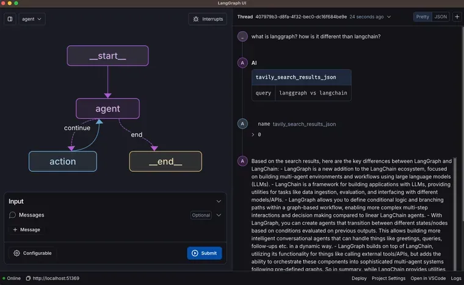

In the rapidly evolving world of artificial intelligence and language models, developers are constantly seeking new tools to streamline their workflow and enhance productivity. Enter Lang Graph Studio, a game-changing Integrated Development Environment (IDE) designed specifically for building complex agentic applications. This innovative platform promises to revolutionize the way teams create and interact with AI-driven systems.

## The Birth of Lang Graph Studio

Lang Graph Studio is built upon the foundation of [Lang Graph](https://langchain-ai.github.io/langgraph/), a framework released several months ago that aims to simplify the creation of intricate agentic applications. With its low-level architecture, built-in persistence layer, and unparalleled controllability, Lang Graph has already made significant strides in accelerating the development process for teams working on AI projects.

Recognizing the unique challenges posed by LLM-based development, the creators of Lang Graph identified a need for a more visual and interactive approach to complement traditional code-heavy methodologies. The result is Lang Graph Studio, an IDE that bridges the gap between conventional software engineering and the iterative nature of AI agent development.

## Key Features of Lang Graph Studio

### 1. Visual Agent Representation

One of the standout features of Lang Graph Studio is its ability to provide a clear, visual representation of agent structures. Developers can easily view nodes, starting points, endpoints, and various branches within their agent designs. This visualization capability proves invaluable when working with complex systems, offering an intuitive way to understand and manipulate agent architectures.

### 2. Real-Time Interaction and Debugging

Lang Graph Studio allows developers to interact with their agents in real-time. Users can send messages to their agents and observe the step-by-step progression of the system's decision-making process. This feature includes the ability to view streaming tokens, tool calls, and final outputs, providing unprecedented insight into the agent's inner workings.

### 3. State Modification and Simulation

A powerful aspect of Lang Graph Studio is the ability to modify the state of an agent mid-execution. Developers can edit variables or outputs at specific points in the agent's process and create parallel threads to explore alternative scenarios. This functionality is particularly useful for testing and refining agent behavior without the need to restart the entire process.

### 4. Debug Mode

The IDE offers a comprehensive debug mode that allows developers to pause execution before each node in the agent's graph. This granular control enables thorough testing and analysis of each step in the agent's decision-making process, facilitating easier identification and resolution of issues.

### 5. Live Code Editing and Prompt Engineering

Lang Graph Studio seamlessly integrates with code editors, allowing developers to make real-time changes to their agent's underlying code. This feature is especially useful for prompt engineering, as developers can modify prompts and immediately see the effects on agent behavior without restarting the entire system.

## Getting Started with Lang Graph Studio

To begin using Lang Graph Studio, developers need to download the desktop application, which runs locally on their machines. The platform requires a Lang Graph graph definition in a Python file, along with some additional configuration settings. These can be set up either through the user interface or via a JSON file.

Currently, Lang Graph Studio is compatible with Python and requires specific environment variables, including API keys for language models and search engines. The platform smartly integrates with existing project structures, automatically detecting and incorporating dependencies from requirement files.

## The Impact on AI Development

Lang Graph Studio represents a significant leap forward in the field of AI development tools. By providing a visual, interactive, and highly flexible environment for building and testing agentic applications, it addresses many of the unique challenges faced by developers working with language models and AI systems.

The platform's ability to accelerate development cycles, facilitate prompt engineering, and provide deep insights into agent behavior positions it as an essential tool for teams looking to push the boundaries of what's possible with AI.

## Conclusion

As AI continues to play an increasingly important role in software development, tools like Lang Graph Studio will become indispensable for developers and teams working on complex agentic applications. By combining powerful visualization capabilities with real-time interaction and debugging features, Lang Graph Studio is poised to become a cornerstone of the AI development ecosystem.

Whether you're a seasoned AI developer or just starting to explore the possibilities of agentic applications, Lang Graph Studio offers a unique and powerful environment to bring your ideas to life. As the platform continues to evolve and incorporate user feedback, it's clear that Lang Graph Studio will play a pivotal role in shaping the future of AI development.

You can find more information about LangGraph Studio [here](https://blog.langchain.dev/langgraph-studio-the-first-agent-ide/).
