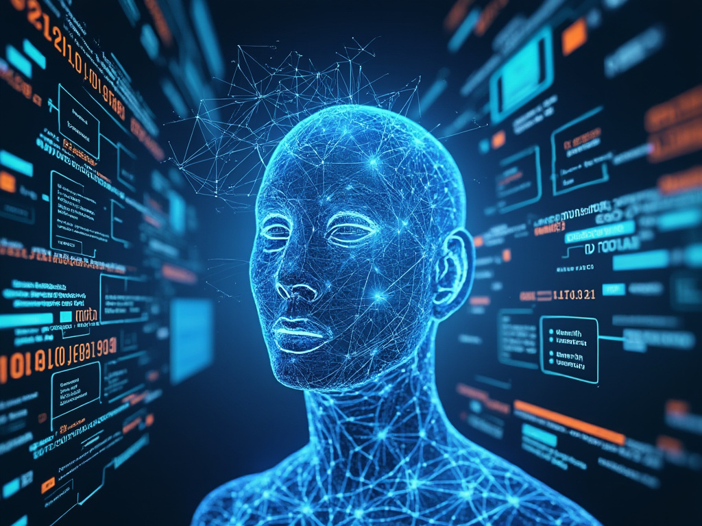

Explore the transformative power of LLM agents in artificial intelligence. Discover how these advanced systems enhance communication, collaboration, and efficiency in various applications, shaping our digital future.

## Understanding LLM Agents: A New Era in Artificial Intelligence

In the rapidly evolving landscape of artificial intelligence, Large Language Model (LLM) agents are emerging as a groundbreaking technology that promises to revolutionize how we interact with intelligent systems.

These sophisticated AI constructs represent a quantum leap in natural language processing, offering unprecedented capabilities in understanding, generating, and manipulating human language.

### Understanding LLM Agents: The Technological Core

At their essence, LLM agents are advanced artificial intelligence systems designed to comprehend and generate human-like text with remarkable precision. Unlike traditional computational models, these agents leverage massive datasets and complex algorithmic frameworks to create contextually nuanced responses that mimic human communication.

Increasingly, LLM agents are being designed as multi-agent systems, where specialized agents collaborate on tasks rather than relying solely on a single model. This shift enhances performance and accuracy in complex scenarios, as seen in recent advancements.

### The Intricate Machinery of LLM Agents

The development of LLM agents follows a meticulous three-stage process:

1. **Data Collection**: Researchers aggregate extensive text repositories from diverse sources, including academic publications, digital archives, and online content. This comprehensive data gathering ensures a broad linguistic and contextual understanding.
2. **Model Training**: Utilizing advanced computational resources, the collected data undergoes rigorous algorithmic processing. Complex machine learning techniques enable the model to discern intricate linguistic patterns, semantic relationships, and contextual nuances.
3. **Deployment**: The trained model transforms into an interactive LLM agent, capable of processing user inputs and generating sophisticated, contextually appropriate responses.

### Transformative Applications

The potential applications of LLM agents span multiple domains:

- **Virtual Assistance**: Providing intelligent, responsive support across various platforms and industries.
- **Content Generation**: Creating high-quality written materials, from articles to comprehensive manuscripts.
- **Global Communication**: Breaking down language barriers through advanced translation capabilities.
- **Multi-Agent Collaboration**: Tackling more complex tasks by allowing different agents to specialize in various functions, improving overall efficiency and effectiveness.

### Unprecedented Advantages

LLM agents offer significant technological advantages:

- **Efficiency**: Processing and responding to queries exponentially faster than human counterparts.
- **Precision**: Minimizing human error through consistently accurate information delivery.
- **Scalability**: Handling vast volumes of interactions simultaneously without performance degradation.
- **Reduced Hallucination Rates**: Through collaborative checks among agents, enhancing reliability and accuracy in critical applications.

### Critical Challenges and Considerations

Despite their impressive capabilities, LLM agents are not without fundamental challenges:

- **Inherent Bias**: The potential to perpetuate biases present in training datasets necessitates rigorous data curation and ongoing model auditing.
- **Interpretability**: The complex "black box" nature of these models creates significant challenges in understanding decision-making processes.
- **Ethical Implications**: Ensuring robust security protocols and maintaining user privacy remains a critical concern.
- **Hallucinations**: The tendency for models to generate plausible but incorrect information poses risks. Multi-agent systems can mitigate this issue by having agents verify each other's outputs, thus improving reliability.

### The Future Landscape

As the field of artificial intelligence continues its rapid evolution, LLM agents represent a pivotal technological frontier. The ongoing challenge lies in balancing technological innovation with ethical considerations, transparency, and societal impact.

Moreover, the growing trend of multi-agent systems in LLM development is set to redefine AI capabilities across various domains. Ongoing research into frameworks that support multi-agent interactions will enhance task performance and broaden the scope of applications.

### Conclusion: A Technological Paradigm Shift

LLM agents are more than just a technological advancement; they represent a fundamental reimagining of human-machine interaction. By continuously refining these systems, researchers and technologists are not merely developing more sophisticated tools but are fundamentally reshaping our understanding of intelligence, communication, and computational potential.

The journey of LLM agents has just begun, and their ultimate impact remains a compelling narrative of human innovation and technological possibility. This revised article incorporates the latest trends and challenges associated with LLM agents while maintaining coherence and accuracy throughout.

Thank you for reading! Stay tuned for more insights on AI, LLMs, and emerging technologies.
For further discussions or inquiries, feel free to reach out via email or social media.
