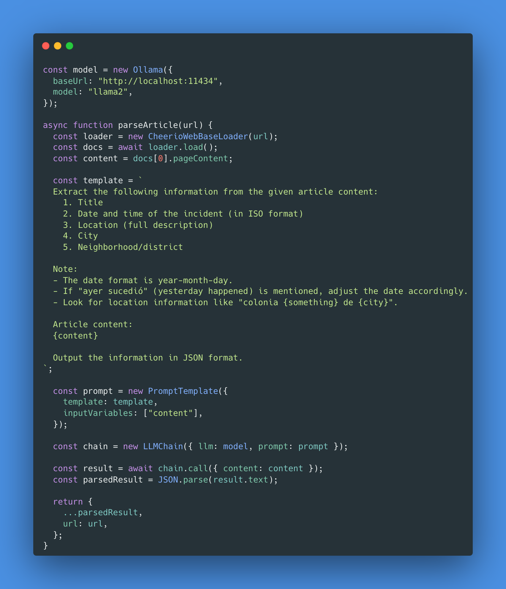
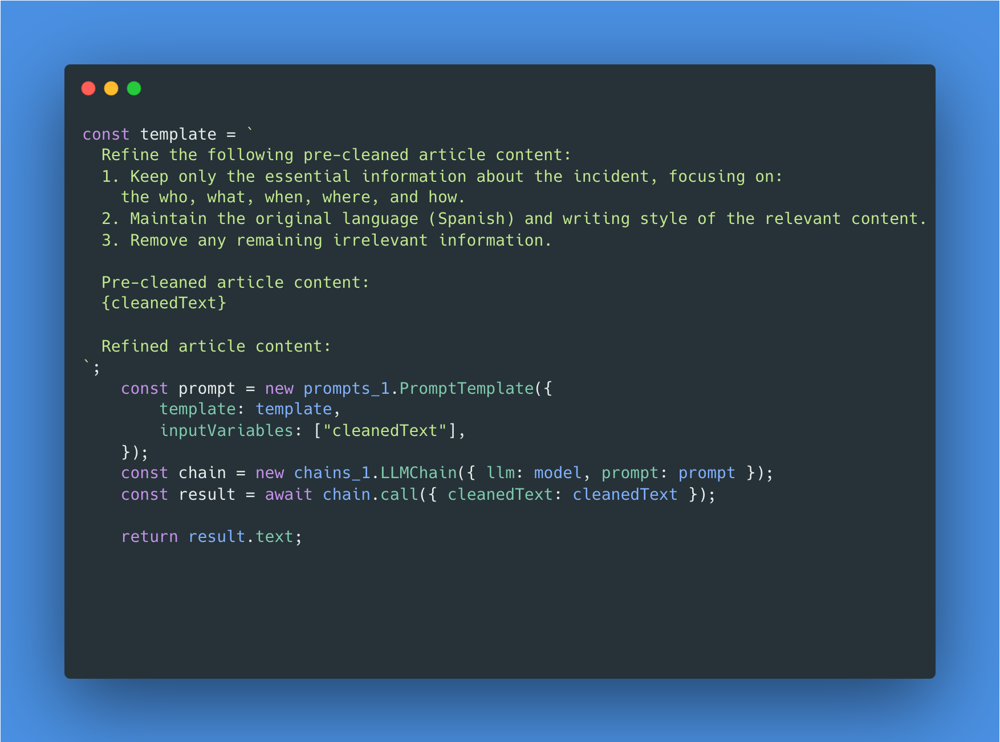

In the face of escalating crime rates and pervasive insecurity, Mexico grapples with a pressing crisis. While the challenges of combating crime are multifaceted, innovative technological solutions can play a crucial role in fostering safety and awareness. 

As a software engineer with a deep understanding of AI and natural language processing, I have embarked on a project that leverages cutting-edge technology to map crime incidents across Mexico. 

This initiative is not just about harnessing technology; it's a call to action for everyone who can make a difference, no matter how small, to contribute toward addressing this issue.

## Leveraging AI for Crime Mapping

The project uses AI models and web scraping techniques to gather crime data from news sources, focusing on providing a comprehensive view of criminal activities throughout Mexico. By leveraging Langchain, a robust library for building language model applications, I've integrated a local AI model, Ollama, which helps process and analyze the data. The goal is to develop a detailed map and database of crime incidents, highlighting patterns, locations, and types of crimes.

This approach allows me to automate the extraction and processing of large volumes of data, providing deeper insights into crime patterns and potentially helping government officials to make informed decisions and deploy prevention campaigns. 

Here’s a glimpse of how AI is being utilized in this project:

- **Data Collection:** Web scraping tools are used to extract crime-related news articles from various sources, ensuring a continuous influx of data for analysis.
- **Natural Language Processing:** AI models process the extracted text, identifying relevant information such as crime types, locations, and dates.
- **Multiple Chain Integration:** By combining Langchain and Ollama, the project benefits from the strengths of both libraries, enabling efficient data processing and analysis. It passes the article's content through multiple chains to extract valuable insights.

The previous image shows the first chain of the project, which is responsible for extracting crime-related news articles from online sources.

Then the data is passed through the second chain, which processes the text and extracts relevant information about the crime incidents filling the database and providing the JSON output to be consumed by the front-end application (In progress).

The code snippets illustrate how the system uses AI to parse article content, extracting structured data such as incident dates, locations, and types of crimes. 
By processing these data points, we can populate an interactive crime map that visually represents where crimes are occurring, helping to identify hotspots and understand crime trends across different regions.

The prompts are simplified for the sake of clarity, but the actual implementation involves a more complex set of instructions and processing steps.

## The Motivation: A Personal and Collective Responsibility

As a resident of Mexico, the pervasive issue of crime and insecurity is not just a news headline—it’s a reality that affects me, my loved ones, and my community daily. 

This project stems from a deep-seated motivation to make a tangible difference. By mapping crime data and making it accessible, we can enhance public awareness, inform policy decisions, and potentially help law enforcement agencies identify crime hotspots and allocate resources more effectively.

## The Impact: More Than Just Data

Crime mapping is more than just placing dots on a map. It’s about understanding the underlying causes and patterns of crime. By making this data available to the public, my goal is to prevent complacency and indifference.

People should not scroll past these issues or ignore the harsh realities of our society. Awareness is the first step toward action, and action is necessary to bring about change. This project serves as a reminder and a tool for all of us—individuals, organizations, and policymakers—to face the issue head-on.

## A Broader Vision: Community Safety and Collaboration

In addition to crime mapping, a parallel initiative I'm working on involves creating a secure, shareable location platform for private groups. This platform will ensure that someone is always on the lookout if a person feels unsafe or goes missing. 

Integrating crime data from this project will enhance the platform’s capabilities, providing users with real-time information about crime-prone areas, thereby making informed decisions about their safety.

## A Call to Action for Technologists

This article marks the beginning of a series where I will document the journey, challenges, and advancements of this crime mapping project. 

Adopting a "build in public" approach, I aim to inspire other technologists to contribute their skills toward solving real-world problems. Whether it's improving this crime map or tackling another pressing issue, every effort counts. The potential of technology is vast, and when used for the right cause, it can be transformative.

As we continue to develop and refine this application, I invite fellow engineers, data scientists, and anyone interested to join this endeavor. Let's use our skills not just for innovation but for meaningful impact. Together, we can contribute to making our communities safer and more informed.

## For Our Families, For Our Future

At the heart of this initiative lies a simple yet profound truth: the safety and well-being of our communities is a collective responsibility, and I deeply reject the notion or thought that such large number of skilled professionals cannot or would not find the way to help this country, and others in this side of the world that need solutions as badly as we do. 

Whether it's for our families, our children, or every individual who calls Mexico home, taking action against crime and insecurity is imperative. By leveraging our skills and resources, we can make a tangible difference. 

It is not just about technology; it's about creating a safer environment where our loved ones can thrive without fear. Together, we have the power to build a better, more secure future for everyone. Let us not wait for someone else to take action—every small effort counts in shaping a safer tomorrow.
